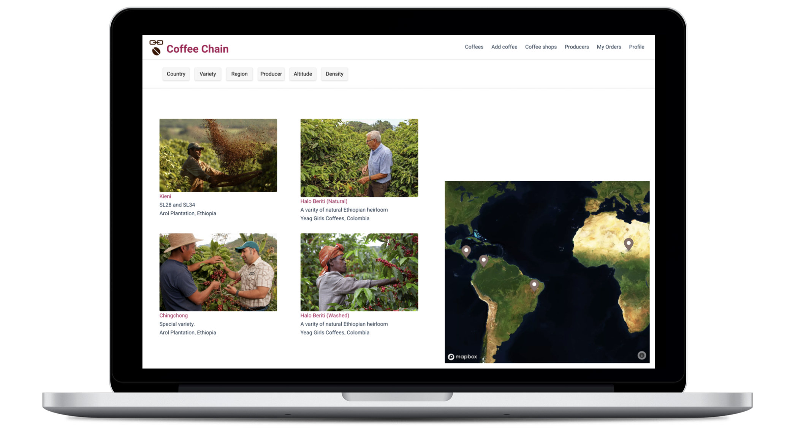
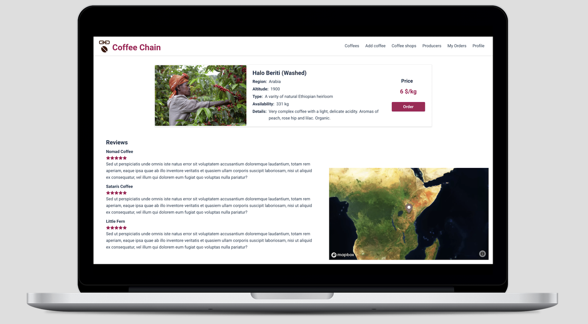
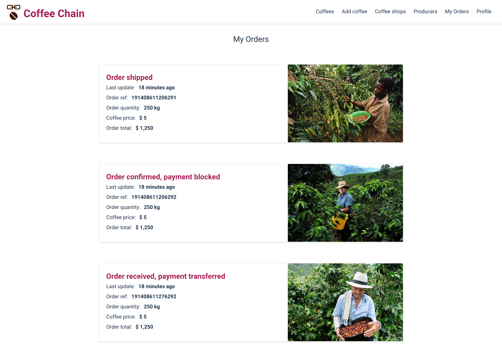
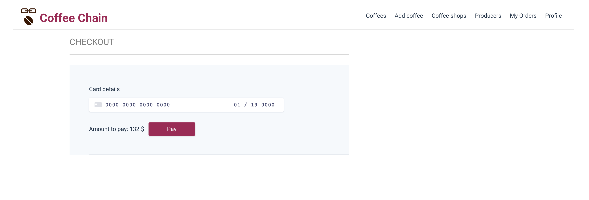

# Coffee Chain


Coffee Chain is a decentralized blockchain app to directly connect specialty coffee producers and coffee shops all around the world, removing intermediaries and supporting fair trade.

## Screenshots & features

### Landing page
All available coffees



### Coffee-detail page
Details of a particular coffee offer

|  |  |

### Order


### Payment



## Getting Started
### Prerequisites
- Node
- Npm
### Set up the server and blockchain
[Coffee Chain backend](https://github.com/chinins/coffee-blockchain-backend)
### Set up the client
1. **Clone the repo**
```
$ git clone https://github.com/chinins/coffee-chain-frontend.git
$ cd coffee-chain-frontend
```
2. **Install dependencies**
```
$ npm install
```
3. **Install and run IPFS daemon**
```
$ npm install -g go-ipfs
$ ipfs daemon
```
**To allow cross-origin for IPFS**
```
$ ipfs config --json API.HTTPHeaders.Access-Control-Allow-Origin "[\"*\"]"
$ ipfs config --json API.HTTPHeaders.Access-Control-Allow-Credentials "[\"true\"]"
```
4. **Run it**
```
$ npm start
```
## Tech Stack

### Frontend
- [React](https://reactjs.org/) - frontend framework
- [Redux](https://redux.js.org/) - predictable state container for JavaScript apps
- [Emotion](https://emotion.sh/) - CSS-in-JS library
- [Stripe](https://stripe.com/es) - online payment system
- [EOS](https://eos.io/) - blockchain infrastructure for decentralised apps

### Backend
- [Koa](https://koajs.com/) - web framework for node.js
- [MySQL](https://www.mysql.com/) - relational database
- [Sequelize](http://docs.sequelizejs.com/) -  promise-based ORM for Node.js
- [Redis](https://redis.io/) - in-memory data structure store, used as a database, cache and message broker
- [Demux](https://github.com/EOSIO/demux-js) - state and side effect handling for blockchain applications
- [Stripe](https://stripe.com/es) - online payment system
- [EOS](https://eos.io/) - blockchain infrastructure for decentralised apps

## Authors
- Olga Chinina - [Github](https://github.com/chinins)
- Marco Galizzi - [Github](https://github.com/Tezenn)
- Leon Hollender - [Github](https://github.com/leonhfr)
- Adria Palleja - [Github](https://github.com/adriapalleja)
- Nathalia Rus - [Github](https://github.com/nathaliarus)

## Contributing
Contributions Welcome!
This is an on-going project and external input and ideas will be gladly recieved!
## License
This project is licensed under the MIT License, take it, have fun.
